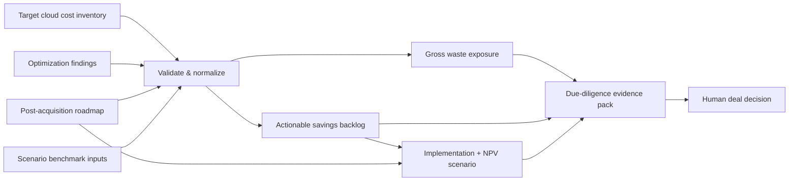
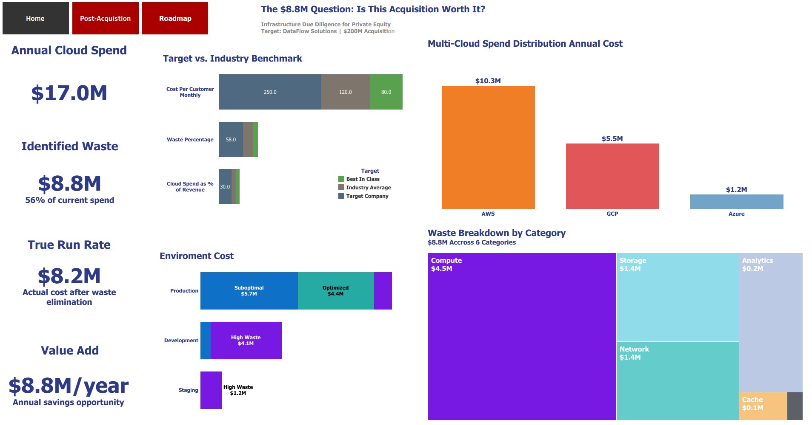

# Infrastructure Due Diligence Intelligence Platform
### Evidence-led FinOps for M&A infrastructure risk

> **The question is not simply “How much cloud waste exists?” It is “Which infrastructure findings are real, which are actionable, what will remediation cost, and how should that evidence change the deal thesis?”**

This repository models an infrastructure due-diligence case for a synthetic multi-cloud SaaS acquisition target. It separates **observed cost exposure**, **modeled remediation opportunity**, **financial scenario assumptions**, and **deal-team judgment** so technical findings do not silently become valuation claims.

## Executive decision summary

Every headline metric below is reproducible from the committed synthetic datasets.

| Decision metric | Verified result | Classification |
| --- | ---: | --- |
| Annual cloud run rate | **$17.04M** | Source evidence |
| Gross waste exposure | **$8.84M** | Source evidence |
| Waste as share of run rate | **51.9%** | Derived evidence |
| Residual run rate if all identified waste were removed | **$8.20M** | Derived evidence |
| Actionable modeled savings backlog | **$7.81M** | Remediation model |
| Low-friction / quick-win opportunity | **$3.61M annualized** | Remediation model |
| Modeled implementation cost | **$1.07M** | Roadmap assumption |
| Staged Year-1 savings capture | **$5.68M** | Financial scenario |
| 5-year NPV @ 10% discount rate | **$26.59M** | Financial scenario |

The distinction between **$8.84M of gross waste exposure** and **$7.81M of modeled actionable savings** is intentional. Not every cost signal should automatically be booked as savings.

## Due-diligence decision contract

This project uses four evidence classes:

1. **Source evidence** — what the synthetic infrastructure data directly shows.
2. **Derived evidence** — arithmetic derived deterministically from source data.
3. **Remediation model** — what the optimization analysis says could be captured.
4. **Deal decision** — valuation, purchase-price adjustment, or go/no-go judgment made by humans using the evidence.

That separation matters. A cloud engineer can identify waste; that does **not** independently determine a purchase-price adjustment.

## What the target data says

The synthetic target carries **$17.04M** in annual cloud spend across AWS, GCP, and Azure.

| Provider | Annual spend | Gross waste exposure |
| --- | ---: | ---: |
| AWS | $10.344M | $6.212M |
| GCP | $5.484M | $2.014M |
| Azure | $1.212M | $0.610M |

Waste is not limited to non-production systems:

| Environment | Annual spend | Gross waste exposure |
| --- | ---: | ---: |
| Production | $11.100M | $3.923M |
| Development | $4.704M | $3.815M |
| Staging | $1.236M | $1.098M |

The largest modeled waste categories are compute (**$4.487M**), network (**$1.398M**), storage (**$1.364M**), and databases (**$1.332M**).

## From waste finding to executable remediation

The optimization analysis models **$7.806M** of annual savings potential across 15 findings.

- **$3.610M** is tagged as quick-win opportunity.
- **$4.196M** requires deeper engineering, architecture, or commercial work.
- The modeled roadmap’s executable leaf initiatives reconcile exactly to the **$7.806M** optimization backlog.
- The difference between gross waste exposure and actionable savings is **$1.030M** and remains explicitly unbooked.

This is the control that prevents an attractive dashboard number from becoming an unsupported financial promise.

## Financial scenario

The financial model uses the executable roadmap rather than the gross-waste headline.

Scenario assumptions:

- roadmap implementation cost: **$1.066M**;
- benefit begins after each initiative’s modeled completion point;
- Year 1 therefore captures a staged **$5.676M**, not a full year of steady-state savings;
- Years 2–5 use the reconciled **$7.806M** annual run-rate opportunity;
- discount rate: **10%**.

Under those assumptions, modeled 5-year NPV is **$26.59M**.

The repository deliberately does **not** convert that result into an automatic acquisition price adjustment. Valuation treatment belongs to the deal team and depends on confidence, execution risk, taxes, transaction structure, overlap with other diligence findings, and the buyer’s investment thesis.

## Analytical flow



## Repository structure

```text
.
├── data/
│   ├── target_cloud_costs.csv
│   ├── optimization_analysis.csv
│   ├── post_acquisition_roadmap.csv
│   └── industry_benchmarks.csv
├── dashboard/
│   └── infrastructure_due_diligence_dashboard.twbx
├── docs/
│   ├── ASSUMPTIONS.md
│   ├── METRIC_LINEAGE.md
│   └── images/
│       ├── executive-dashboard.jpg
│       ├── implementation-roadmap.jpg
│       └── post-acquisition-red-flags.jpg
├── src/
│   └── infra_due_diligence/
│       ├── __init__.py
│       ├── evidence.py
│       ├── financial_model.py
│       └── report.py
├── tests/
│   ├── test_evidence.py
│   └── test_financial_model.py
├── .github/workflows/ci.yml
├── pyproject.toml
└── README.md
```

## Reproduce the evidence

No third-party Python packages are required.

```bash
PYTHONPATH=src python -m infra_due_diligence.report --data-dir data --verify
PYTHONPATH=src python -m unittest discover -s tests -v
```

The verifier checks:

- `Annual_Cost == Monthly_Cost × 12` for every target-cost row;
- gross waste never exceeds annual cost;
- gross exposure and actionable savings are kept separate;
- optimization savings reconcile to executable roadmap leaf initiatives;
- summary roadmap rows are excluded from financial double counting;
- staged Year-1 capture and 5-year NPV reproduce deterministically;
- scenario benchmarks remain labeled as synthetic inputs, not external facts.

CI runs source compilation, tests, deterministic verification, and a whitespace check on every push and pull request.

## Tableau case study

The original Tableau workbook and dashboard evidence are preserved in the repository. The dashboard is an executive communication layer; the Python verifier is the analytical control layer.

[View the Tableau Public dashboard](https://public.tableau.com/app/profile/tagm/viz/FinOpsforMAInfrastructureDueDiligenceDashboardCaseStudy/Dashboard1#1)



## Data provenance and limitations

All data is **fully synthetic** and modeled to resemble a multi-cloud SaaS acquisition target. No real account information, customer data, PII, proprietary billing records, or transaction data are included.

The industry benchmark file is also synthetic scenario input. It should not be presented as current external market research.

See [METRIC_LINEAGE.md](docs/METRIC_LINEAGE.md) for exact formulas and [ASSUMPTIONS.md](docs/ASSUMPTIONS.md) for the boundary between evidence and scenario judgment.

## Portfolio framing

This is not a “find cloud waste” demo.

It demonstrates a more difficult capability:

**technical evidence → remediation feasibility → financial modeling → deal-risk communication**

The most important output is not the $8.84M number. It is the ability to show **which number came from where, what assumptions were introduced, and where human judgment must begin.**

---

Built by Tracy Anne Griffin Manning  
[LinkedIn](https://www.linkedin.com/in/tracymanning/) · [Tableau Dashboard](https://public.tableau.com/app/profile/tagm/viz/FinOpsforMAInfrastructureDueDiligenceDashboardCaseStudy/Dashboard1#1)
